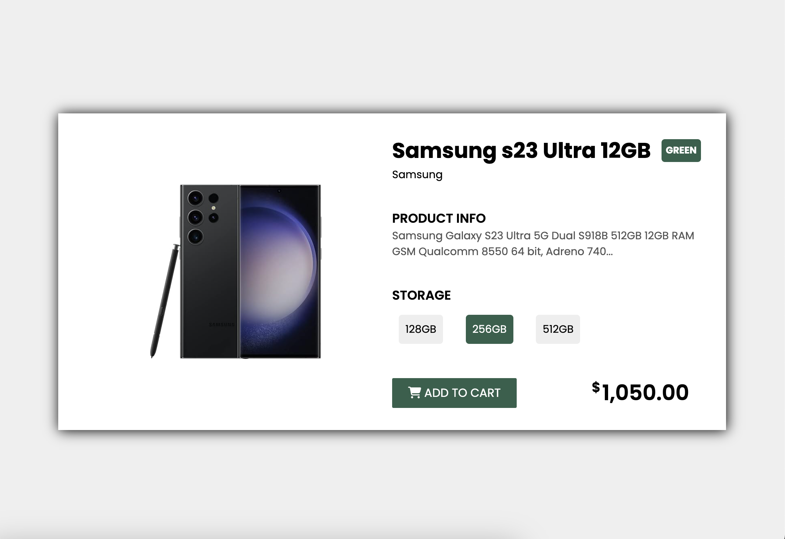

<a name="readme-top"></a>

 
<!-- PROJECT LOGO -->
<br />
<div align="center">
  <a href="https://github.com/ibrsec/product-card/">
    
  </a>

  <h3 align="center">Product Card</h3>

  <p align="center">
    An awesome Product Card example project!
    <br />
    <a href="https://github.com/ibrsec/product-card"><strong>Explore the docs »</strong></a>
    <br />
    <br />
    <a href="https://ibrsec.github.io/product-card/">View Demo</a>
    ·
    <a href="https://github.com/ibrsec/product-card/issues">Report Bug</a>
    ·
    <a href="https://github.com/ibrsec/product-card/issues">Request Feature</a>
  </p>
</div>


<!-- TABLE OF CONTENTS -->
<details>
  <summary>Table of Contents</summary>
  <ol>
    <li><a href="#about-the-project">About The Project</a></li>
     <li><a href="#figma">Figma</a></li>
     <li><a href="#project-skeleton">Project Skeleton</a></li>
     <li><a href="#built-with">Built With</a></li>
    <!-- <li>
      <a href="#getting-started">Getting Started</a>
      <ul>
        <li><a href="#prerequisites">Prerequisites</a></li>
        <li><a href="#installation">Installation</a></li>
      </ul>
    </li>
    <li><a href="#usage">Usage</a></li>
    <li><a href="#roadmap">Roadmap</a></li>
    <li><a href="#contributing">Contributing</a></li>
    <li><a href="#license">License</a></li>
    <li><a href="#contact">Contact</a></li>
    <li><a href="#acknowledgments">Acknowledgments</a></li> -->
  </ol>
</details>


---

<!-- ABOUT THE PROJECT -->
## About The Project

[](https://ibrsec.github.io/product-card/)


<p align="right">(<a href="#readme-top">back to top</a>)</p>

---

## Figma 
<a href="https://www.figma.com/file/4vIk8df2tzq9ofwIXoMVfG/Untitled?type=design&node-id=0%3A1&mode=design&t=g0wWEIJIn5KpHnUf-1">Figma Link</a>

<p align="right">(<a href="#readme-top">back to top</a>)</p>


---

## Project Skeleton 

```
Google-Learning (folder)
|
|----readme.md        
|----img (folder)              
|----index.html  
|----style.css
```

<p align="right">(<a href="#readme-top">back to top</a>)</p>

---

### Built With


<!-- https://dev.to/envoy_/150-badges-for-github-pnk  search skills-->

* 
*  


<p align="right">(<a href="#readme-top">back to top</a>)</p>


